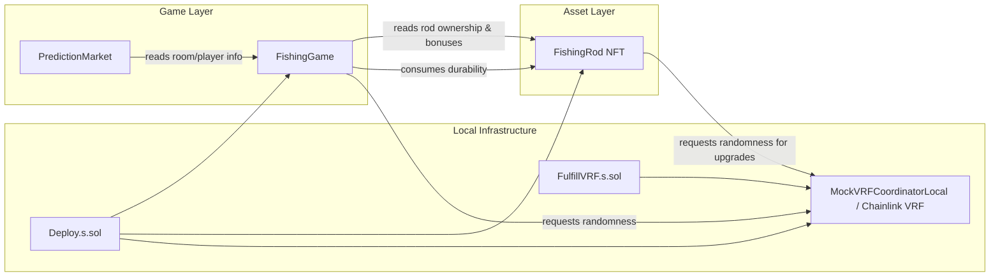
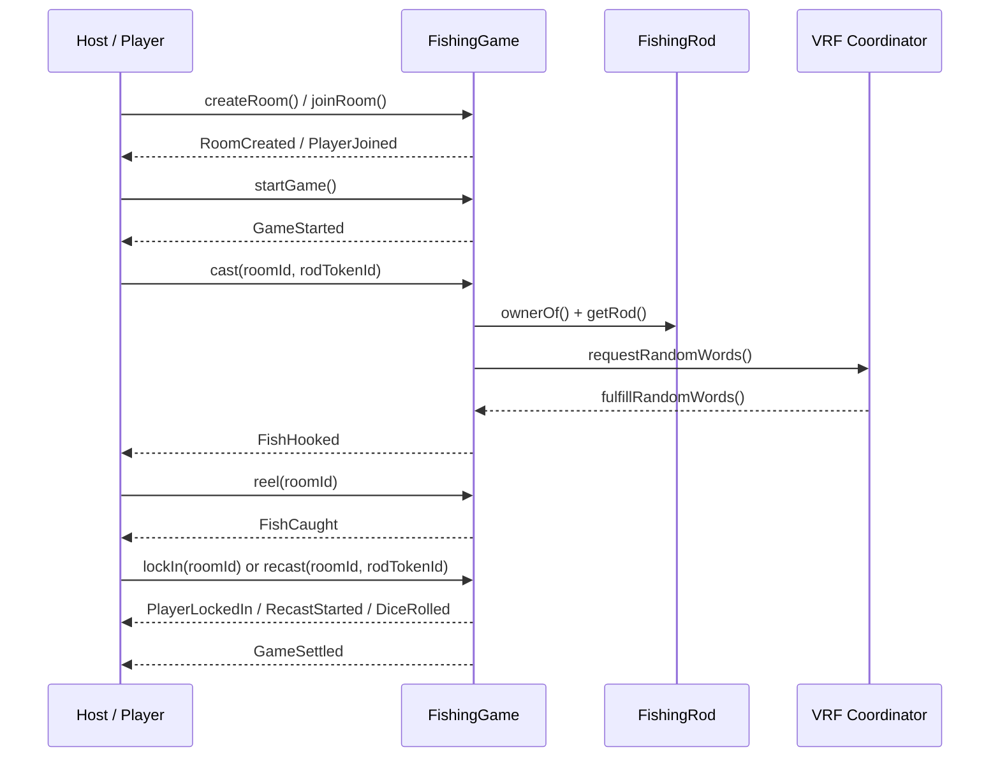
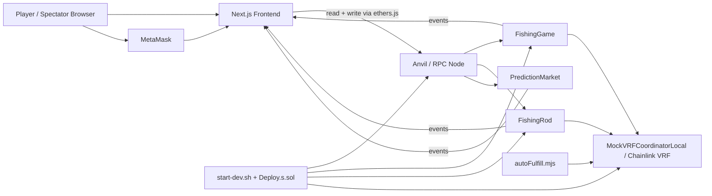

# DeepCast Architecture Overview

## 1. Project Summary

DeepCast is a fully on-chain fishing game platform built from three main layers:

- The **game contracts** manage fishing rooms, player state, scoring, settlement, and rod integration.
- The **rod contract** represents upgradeable NFT fishing rods with durability and stat bonuses.
- The **prediction market** lets spectators bet on game outcomes and claim prize shares after settlement.
- The **Next.js frontend** provides the lobby, room flow, fishing gameplay, rod management, settlement view, and spectator market UI.
- The **local dev runtime** deploys contracts to Anvil, writes environment variables, and auto-fulfills VRF requests.

The repository is structured as a local-first application, but the architecture is compatible with a testnet deployment model because all user actions are already expressed through Ethereum contracts and event-driven UI updates.

## 2. Repository Layout

- `contracts/src/FishingGame.sol`: core room and fishing gameplay logic.
- `contracts/src/FishingRod.sol`: ERC-721 fishing rod NFT, repair, and upgrade logic.
- `contracts/src/PredictionMarket.sol`: spectator betting market tied to a FishingGame room.
- `contracts/script/Deploy.s.sol`: local deployment script that wires the contracts together.
- `contracts/script/MockVRFLocal.sol`: local VRF mock used for deterministic development.
- `contracts/script/FulfillVRF.s.sol`: manual helper for fulfilling VRF requests.
- `frontend/app/**`: Next.js App Router pages.
- `frontend/components/**`: reusable UI components.
- `frontend/lib/**`: contract ABIs, wallet helpers, rod helpers, and data mappers.
- `start-dev.sh`: end-to-end local bootstrapping script.

## 3. On-Chain Architecture

### 3.1 Core Contracts

#### FishingGame

FishingGame is the main game state machine. It manages:

- room creation and player joins,
- active game flow for casting, reeling, recasting, and locking in,
- score calculation,
- final prize distribution,
- rod snapshot validation during gameplay,
- VRF requests for fish generation and recast dice rolls.

Key domain concepts:

- `RoomStatus`: `Waiting`, `Active`, `Finished`.
- `PlayerStatus`: `Fishing`, `LockedIn`, `Recast`.
- `RoomTier`: `Bronze`, `Silver`, `Gold`, `Diamond`.
- `Rarity`: `Common`, `Rare`, `SuperRare`, `Epic`, `Legendary`.

Important mechanics:

- A room requires an entry fee based on its tier.
- Hosts and players must own a rod that satisfies the tier requirement.
- `cast()` requests Chainlink VRF randomness and snapshots the equipped rod bonuses.
- `reel()` converts the hook result into a scored fish.
- `recast()` consumes an additional fee, requests more randomness, and may apply a dice modifier.
- `lockIn()` finalizes a player score if their fish has been reeled.
- `forceComplete()` allows anyone to finalize a timed-out active room.
- `_settleGame()` ranks players, pays the top 3, and sends the platform fee to the owner.

Important events:

- `RoomCreated`
- `PlayerJoined`
- `GameStarted`
- `CastRequested`
- `FishHooked`
- `FishCaught`
- `PlayerLockedIn`
- `RecastStarted`
- `DiceRolled`
- `GameSettled`
- `RodUsed`

The contract is intentionally event-rich so the frontend can build responsive screens without polling every state transition.

#### FishingRod

FishingRod is an upgradeable ERC-721 NFT contract. It handles:

- minting rods with tiered pricing,
- durability consumption during gameplay,
- ETH-based repairs,
- VRF-based upgrades,
- stat storage for speed, weight, luck, and stability.

Important mechanics:

- Each rod has a `RodType`, `RodRarity`, level, durability, and stat bonuses.
- `mintRod()` creates a new NFT and initializes its stats.
- `consumeDurability()` can only be called by the game contract.
- `repairFull()` and `repairPartial()` restore durability for ETH.
- `upgrade()` requests VRF randomness and stores a pending upgrade request.
- `fulfillRandomWords()` resolves the upgrade, with success chance and stat changes determined by random values.

Important events:

- `RodMinted`
- `DurabilityConsumed`
- `RodRepaired`
- `UpgradeRequested`
- `UpgradeResolved`
- `GameContractSet`
- `RepairTokenSet`

The rod contract acts as both a progression system and a gameplay dependency, because the game reads rod bonuses during fishing and uses rod ownership as room eligibility.

#### PredictionMarket

PredictionMarket is a separate settlement layer for spectators. It is not part of the core fishing gameplay loop, but it consumes live data from FishingGame.

Important mechanics:

- `openBetting()` opens the market once a room becomes active.
- `placeBet()` records weighted bets, where earlier bets receive a higher time weight.
- `settleBets()` can be called by anyone once the room is finished.
- `claimPrize()` pays bettors from the winner-specific prize pool.
- `withdrawUnclaimed()` allows the owner to sweep expired funds after the claim window.

The market is read-only dependent on FishingGame for:

- room status,
- player list,
- final winner resolution.

That keeps the market trust-minimized: it does not require a separate oracle for the game outcome.

### 3.2 Supporting Runtime Pieces

#### MockVRFCoordinatorLocal

`contracts/script/MockVRFLocal.sol` provides a local replacement for Chainlink VRF. It records requests, generates pseudo-random words, and calls `rawFulfillRandomWords(...)` on the consumer contract.

#### Deploy Script

`contracts/script/Deploy.s.sol` deploys:

- `MockVRFCoordinatorLocal`,
- `FishingGame`,
- `FishingRod`.

It then links the game and rod contracts together and writes addresses to `contracts/deployments/localhost.json`.

#### VRF Fulfillment Script

`contracts/script/FulfillVRF.s.sol` is a manual helper for fulfilling a pending VRF request when you want deterministic control during local testing.

### 3.3 Contract Relationship Diagram



### 3.4 Game Flow Sequence



## 4. Frontend Architecture

### 4.1 Frontend Stack

The frontend is a Next.js App Router application using React, ethers.js, and a wallet-first interaction model.

Key dependencies from `frontend/package.json`:

- `next`
- `react`
- `ethers`
- `lucide-react`

The frontend is built around a few deliberate layers:

- **pages** provide the user-facing routes,
- **components** render reusable UI blocks,
- **lib** provides contract bindings, wallet state, and rod data utilities.

### 4.2 Page Responsibilities

#### Lobby and room discovery

`frontend/app/page.tsx` is the landing lobby. It reads room state from the FishingGame contract, filters waiting rooms, and navigates to create-room or waiting-room flows.

#### Create room

`frontend/app/create-room/page.tsx` lets a user choose a tier, toggle public/private and livestream flags, validate rod ownership/level, call `createRoom()`, and route into the waiting room.

#### Waiting room

`frontend/app/waiting-room/page.tsx` reads room metadata and players, watches `PlayerJoined` and `GameStarted`, and transitions into the actual game screen when the host starts the match.

#### Gameplay screen

`frontend/app/game/[roomId]/page.tsx` is the core interactive gameplay UI. It tracks the local phase machine, subscribes to game events, fetches room/player data, resolves owned rods, and drives cast/reel/lock-in/recast actions.

#### Rod inventory

`frontend/app/rods/page.tsx` lists owned rods and shows purchase entry points.

#### Rod detail

`frontend/app/rods/[tokenId]/page.tsx` shows rod stats, durability, repair quotes, and upgrade actions. It also subscribes to upgrade result events and refreshes the rod state when the chain resolves.

#### Settlement

`frontend/app/settlement/page.tsx` reads final room results and presents ranked winners with animated result cards.

#### Spectator market

`frontend/app/spectator/[roomId]/page.tsx` is the betting-oriented live room view. It reads live player data, odds, and market state from the prediction market contract ABI.

### 4.3 Component Responsibilities

#### `Navbar`

Provides global brand identity and wallet connection entry point.

#### `AnnouncementBar`

Shows a scrolling activity feed to make the lobby feel alive.

#### `RoomCard`

Renders room tier, fee, occupancy, livestream state, and join/watch actions.

#### `RodCard`

Displays rod identity, rarity, level, durability, and attribute bonuses.

#### `RodDurabilityBar`

Shows the rod wear state with a simple progress indicator.

### 4.4 Frontend State and Contract Access Layer

`frontend/lib/ethereum.ts` is the primary wallet and contract access layer.

It provides:

- `useWallet()` for MetaMask connection, chain tracking, and account-change handling,
- `useContract()` for read-only, RPC-based read access, and signer-based write access,
- helpers for local network switching.

`frontend/lib/contract.ts` holds:

- contract addresses from environment variables,
- ABIs for FishingGame and PredictionMarket,
- tier labels and room-status constants,
- `requiredRodLevelForTier()` and related UI helpers.

`frontend/lib/fishingRod.ts` holds:

- rod contract ABI fragments,
- mint/repair/upgrade helpers,
- event subscription helpers,
- read mappers that convert chain tuples into frontend-friendly rod objects,
- wallet write helpers for rod transactions.

`frontend/lib/rod.ts` defines the rod domain model used by the UI, including rod types, rarity colors, upgrade tables, mock rods, and local fallback pricing.

### 4.5 Frontend Data Flow

The UI follows a consistent pattern:

1. Connect wallet via MetaMask.
2. Read chain state via RPC or signer-backed contract calls.
3. Render a page with optimistic or fallback mock data when the chain is not ready.
4. Subscribe to contract events for refreshes.
5. Send transactions only from the signer-backed write contract.

This model appears throughout the pages:

- lobby refreshes on `RoomCreated`,
- waiting room refreshes on `PlayerJoined` and routes on `GameStarted`,
- game screen listens for `FishHooked`, `FishCaught`, and settlement events,
- rod detail listens for `UpgradeResolved`.

### 4.6 Frontend Component Diagram

```mermaid
flowchart TB
	subgraph App Routes
		Home[app/page.tsx]
		Create[app/create-room/page.tsx]
		Waiting[app/waiting-room/page.tsx]
		Game[app/game/[roomId]/page.tsx]
		Rods[app/rods/page.tsx]
		RodDetail[app/rods/[tokenId]/page.tsx]
		Settlement[app/settlement/page.tsx]
		Spectator[app/spectator/[roomId]/page.tsx]
	end

	subgraph Shared UI
		Navbar[components/ui/Navbar.tsx]
		Banner[components/ui/AnnouncementBar.tsx]
		RoomCard[components/lobby/RoomCard.tsx]
		RodCard[components/rods/RodCard.tsx]
		Durability[components/rods/RodDurabilityBar.tsx]
	end

	subgraph Frontend Lib
		Eth[lib/ethereum.ts]
		ContractDefs[lib/contract.ts]
		RodHelpers[lib/fishingRod.ts]
		RodModel[lib/rod.ts]
	end

	Home --> Navbar
	Home --> Banner
	Home --> RoomCard
	Create --> Navbar
	Waiting --> Navbar
	Game --> Navbar
	Rods --> Navbar
	Rods --> RodCard
	RodDetail --> Navbar
	RodDetail --> RodCard
	RodDetail --> Durability
	Settlement --> Navbar
	Spectator --> Navbar

	Home --> Eth
	Create --> Eth
	Waiting --> Eth
	Game --> Eth
	Rods --> Eth
	RodDetail --> Eth
	Settlement --> Eth
	Spectator --> Eth

	Home --> ContractDefs
	Create --> ContractDefs
	Waiting --> ContractDefs
	Game --> ContractDefs
	Settlement --> ContractDefs
	Spectator --> ContractDefs

	Rods --> RodHelpers
	RodDetail --> RodHelpers
	Game --> RodHelpers
	Game --> RodModel
	Rods --> RodModel
	RodDetail --> RodModel
```

## 5. End-to-End System Architecture

### 5.1 Runtime Topology

The full system is designed around a local blockchain workflow:

1. `start-dev.sh` boots Anvil and restores state when available.
2. The deployment script writes contract addresses to `contracts/deployments/localhost.json`.
3. `start-dev.sh` propagates the addresses into `frontend/.env.local`.
4. The frontend reads those addresses and connects to the local RPC endpoint.
5. `frontend/scripts/autoFulfill.mjs` watches for VRF requests and fulfills them in development.

This gives the repository a reproducible end-to-end loop for room creation, gameplay, rod progression, and settlement.

### 5.2 Overall Architecture Diagram



## 6. Main User Journeys

### 6.1 Create and join a room

- The user opens the lobby and sees waiting rooms.
- The user creates a room or joins an existing one.
- The frontend checks whether the wallet owns a rod at the required level for the tier.
- On-chain, `FishingGame` records the room and player state.

### 6.2 Start and play the game

- The host starts the match.
- Each player selects a rod and casts.
- VRF resolves fish rarity and weight.
- The player reels, optionally recasts, and locks in.
- Once everyone is locked, the game settles and emits the final ranking event.

### 6.3 Manage rods

- The user opens the rod library.
- The frontend reads owned NFT rods.
- The user repairs or upgrades a rod.
- The rod contract updates durability or resolves an upgrade through VRF.

### 6.4 Spectate and bet

- A spectator opens the market room.
- The market reads room/player data from FishingGame.
- The spectator places a weighted bet.
- After settlement, the spectator claims the prize if they backed the winner.

## 7. Design Notes

- The architecture favors **event-driven UI refreshes** over constant polling.
- The architecture separates **game state**, **asset state**, and **spectator market state** into distinct contracts.
- The rod system is both a **progression mechanic** and a **room eligibility gate**.
- The development workflow is optimized for **local deterministic testing** with Anvil and a mock VRF coordinator.
- Several frontend screens include **mock fallback data** so the UI remains usable even before the chain is ready.

## 8. Files Worth Reading Next

- [contracts/src/FishingGame.sol](../contracts/src/FishingGame.sol)
- [contracts/src/FishingRod.sol](../contracts/src/FishingRod.sol)
- [contracts/src/PredictionMarket.sol](../contracts/src/PredictionMarket.sol)
- [frontend/lib/ethereum.ts](../frontend/lib/ethereum.ts)
- [frontend/lib/contract.ts](../frontend/lib/contract.ts)
- [frontend/lib/fishingRod.ts](../frontend/lib/fishingRod.ts)
- [frontend/app/page.tsx](../frontend/app/page.tsx)
- [frontend/app/game/[roomId]/page.tsx](../frontend/app/game/[roomId]/page.tsx)
- [start-dev.sh](../start-dev.sh)

## 9. Scope Note

This document is generated from the current repository snapshot. It describes the architecture implemented in code, including the local development scripts and the frontend fallback behavior.
